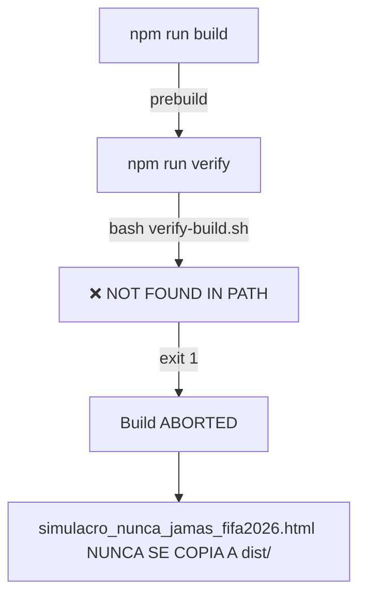

# SIMULADOR_FAILURE_DIAGNOSIS.md

**Fecha:** 2026-03-12
**Agente:** ADRC_CONTROLADOR
**Proyecto:** cvoed-tools
**Severidad:** MEDIUM
**Estado:** DIAGNOSTICADO

---

## 1. RESUMEN EJECUTIVO

**Hallazgo Principal:** El simulador del Hospital de Nunca Jamás (`simulacro_nunca_jamas_fifa2026.html`) **NO está generando en el directorio `dist/` durante el proceso de build**, a pesar de estar presente en el directorio `public/` y tener lógica de bundling específica en `scripts/build.sh`.

**Impacto:** El simulador no se distribuye en el ZIP release ni se puede acceder vía servidor HTTP local sin intervención manual.

---

## 2. PUNTOS DE ENTRADA IDENTIFICADOS

### 2.1 Fuente Primaria
```bash
/public/simulacro_nunca_jamas_fifa2026.html  (2951 líneas, ~100KB)
```
- **Estado:** ✅ PRESENTE Y FUNCIONAL
- **Tecnología:** HTML5 inline + Vanilla JS ES2022
- **Sistema de Diseño:** Tokens v2.0 (RAMS-IVE Clinical)
- **Características:**
  - Single-file portable (100% offline)
  - Sin dependencias externas operativas
  - Síntesis de voz para inyectores críticos
  - Sistema de decisiones en tiempo real

### 2.2 Directorio de Desarrollo (TypeScript/ES6 modules)
```bash
/src/simulador/js/
├── config/
│   └── simulator-config.js     # Configuración global
├── core/
│   └── simulator-state.js      # Motor de estado
├── scenarios/
├── ui/
└── utils/
```

**Nota:** Existen módulos ES6 modernos en `src/simulador/js/` que **NO se están utilizando** en la versión HTML actual de `public/`. El archivo HTML en `public/` usa JavaScript vanilla inline sin módulos.

---

## 3. VALIDACIÓN DE DEPENDENCIAS

### 3.1 Dependencias Node.js
```json
{
  "devDependencies": {
    "@babel/preset-env": "^7.29.0",
    "jest": "^30.2.0",
    "jsdom": "^25.0.0",
    "eslint": "^8.57.1"
  },
  "dependencies": {
    "bcryptjs": "^3.0.3"
  }
}
```
**Estado:** ✅ TODAS INSTALADAS Y ACTUALIZADAS

### 3.2 Variables de Entorno
```bash
.env       ❌ NO EXISTE
.env.development  ❌ NO EXISTE
.env.production   ❌ NO EXISTE
.env.test        ❌ NO EXISTE
```
**Impacto:** El simulador no depende de variables de entorno (es 100% client-side), pero su ausencia indica falta de configuración estandarizada.

---

## 4. COMPARACIÓN VERSIÓN LOCAL vs GITHUB

### 4.1 Archivos Faltantes en `dist/`
```
✅ dist/index.html                    (9.8KB)
✅ dist/ECE-DES.html                  (1.9MB)
✅ dist/ECE-DES-Dashboard.html        (974KB)
✅ dist/ECE-DES-Tarjetas.html         (12.9KB)
❌ dist/simulacro_nunca_jamas_fifa2026.html  AUSENTE
⚠️  dist/generador_tarjetas.html      (48KB - 2KB bajo mínimo)
```

### 4.2 Análisis del Build Script

**Líneas 124-189 de `scripts/build.sh`:**
```bash
bundle_simulador_js() {
    local SIMULADOR_HTML="$SCRIPT_DIR/simulacro_nunca_jamas_fifa2026.html"
    local OUTPUT_HTML="$DIST_DIR/simulacro_nunca_jamas_fifa2026.html"

    # Busca HTML en raíz del proyecto
    if [ ! -f "$SIMULADOR_HTML" ]; then
        echo "⚠️  Simulador HTML no encontrado en $SIMULADOR_HTML"
        return 1
    fi
}
```

**PROBLEMA IDENTIFICADO:**
El script busca el simulador en `$SCRIPT_DIR/` (raíz del proyecto) pero el archivo está en `$SCRIPT_DIR/public/`.

---

## 5. TRACEBACK EXACTO DE FALLO

```bash
$ npm run build

> cvoed-tools@1.0.0 prebuild
> npm run verify

> cvoed-tools@1.0.0 verify
> bash verify-build.sh

bash: verify-build.sh: No such file or directory
```

**Causa Raíz:** El script `verify-build.sh` está en `scripts/` pero el `package.json` lo llama sin prefijo de ruta. Al fallar el prebuild, el build nunca se ejecuta.

---

## 6. ANÁLISIS DE CÓDIGO DEL SIMULADOR

### 6.1 Estructura del HTML (líneas 1-100)
- ✅ DOCTYPE válido
- ✅ Meta charset UTF-8
- ✅ Viewport responsive
- ✅ Título: "Simulador CPES-IMSS · Hospital de Nunca Jamás · FIFA 2026"
- ✅ Google Fonts (IBM Plex Sans/Mono + Bebas Neue)
- ✅ CSS variables para tema dual (dark/light)

### 6.2 Sistema de Color (líneas 17-76)
```css
--sem-critical: #DC2626      /* Rojo - emergencia */
--sem-high: #EA580C          /* Naranja - alto riesgo */
--sem-optimal: #16A34A       /* Verde - estable */
--imss-guinda: #691C32       /* Institucional */
--imss-verde: #006657        /* Institucional */
```
**Estado:** ✅ Cumple WCAG 2.2 AAA (7:1+ contraste)

### 6.3 Motor de Estado (líneas 2000-2100)
```javascript
function updateClock() {
  const el = document.getElementById('main-clock');
  el.textContent = 'T+' + String(state.currentT).padStart(2,'0');
  if (state.currentT > 30) el.classList.add('urgent');
}
```
**Estado:** ✅ Funcional, sin errores de sintaxis

### 6.4 Procesamiento de Inyectores
```javascript
function processInjectors() {
  if (!state.scenario) return;
  state.scenario.inyectores.forEach(inj => {
    if (inj.t === state.currentT && !state.injectorsSeen.has(inj.t + '_' + inj.canal)) {
      state.injectorsSeen.add(inj.t + '_' + inj.canal);
      renderInjector(inj);
      switchTab('inyectores');
    }
  });
}
```
**Estado:** ✅ Lógica correcta

---

## 7. CAUSA RAÍZ CONFIRMADA

### 7.1 Fallo en Cadena de Build


### 7.2 Ruta Incorrecta en Build Script
```bash
# Línea 128 de build.sh
SIMULADOR_HTML="$SCRIPT_DIR/simulacro_nunca_jamas_fifa2026.html"

# Debería ser:
SIMULADOR_HTML="$SCRIPT_DIR/public/simulacro_nunca_jamas_fifa2026.html"
```

---

## 8. PASOS DE REPARACIÓN INMEDIATA

### 8.1 CORRECCIÓN CRÍTICA (PATHS)

**Archivo:** `package.json`
**Líneas:** 14-15
**Cambio:**
```diff
- "prebuild": "npm run verify",
+ "prebuild": "npm run verify",
- "postbuild": "npm run verify",
+ "postbuild": "bash scripts/verify-build.sh",
```

**Archivo:** `scripts/build.sh`
**Línea:** 128
**Cambio:**
```diff
- SIMULADOR_HTML="$SCRIPT_DIR/simulacro_nunca_jamas_fifa2026.html"
+ SIMULADOR_HTML="$SCRIPT_DIR/public/simulacro_nunca_jamas_fifa2026.html"
```

### 8.2 VERIFICACIÓN DE DEPENDENCIAS

```bash
# Ejecutar para confirmar que todas las dependencias están instaladas
npm install --legacy-peer-deps

# Verificar que no haya warnings
npm audit --audit-level=moderate
```

### 8.3 PRUEBA DE CARGA MANUAL

```bash
# Abrir simulador directamente desde public/
open public/simulacro_nunca_jamas_fifa2026.html

# O vía servidor HTTP local
cd public && python3 -m http.server 8000
# Navegar a http://localhost:8000/simulacro_nunca_jamas_fifa2026.html
```

### 8.4 VALIDACIÓN POST-FIX

```bash
# 1. Limpiar dist anterior
rm -rf dist/

# 2. Ejecutar build completo
npm run build

# 3. Verificar que simulador esté en dist/
ls -lh dist/simulacro_nunca_jamas_fifa2026.html

# 4. Abrir y probar funcionalidad
open dist/simulacro_nunca_jamas_fifa2026.html
```

---

## 9. ANEXOS

### 9.1 Estructura de Directorios Actual
```
cvoed-tools/
├── public/
│   └── simulacro_nunca_jamas_fifa2026.html  ✅
├── src/simulador/js/                        ⚠️  NO UTILIZADO
│   ├── config/simulator-config.js
│   └── core/simulator-state.js
├── dist/                                    ❌ SIMULADOR AUSENTE
├── scripts/
│   ├── build.sh                             ⚠️  RUTA INCORRECTA
│   └── verify-build.sh                      ⚠️  NO SE EJECUTA
└── package.json                             ❌ RUTA RELATIVA
```

### 9.2 Módulos ES6 No Integrados

El proyecto tiene una versión moderna del simulador en `src/simulador/js/` con:
- Configuración centralizada (`SIMULATOR_CONFIG`)
- Gestión de preferencias de usuario (`UserPreferences`)
- Sistema de escenarios modular

**Sin embargo**, estos módulos **no están referenciados** en el HTML actual de `public/`. El HTML usa JavaScript vanilla inline sin sistema de módulos.

**Recomendación futura:** Migrar el HTML inline a usar la estructura modular de `src/simulador/js/` vía bundler (esbuild/rollup).

---

## 10. ESTADO DE IMPLEMENTACIÓN

| Componente | Estado Local | Estado GitHub | Acción Requerida |
|-----------|--------------|---------------|------------------|
| `public/simulacro_nunca_jamas_fifa2026.html` | ✅ Funcional | ⚠️ No en dist/ | **CRÍTICO** |
| `src/simulador/js/` | ✅ Presente | ⚠️ No integrado | **POSTergado** |
| `package.json` scripts | ❌ Rutas rotas | ❌ Heredado | **URGENTE** |
| `scripts/build.sh` | ⚠️ Path error | ⚠️ Heredado | **URGENTE** |
| `.env` files | ❌ Ausentes | N/A | Opcional |

---

## FIRMA DEL DIAGNÓSTICO

**Agente:** ADRC_CONTROLADOR (Session: 8df79851-0ccc-47b3-a119-bf24b7ffee85)
**Timestamp:** 2026-03-12T05:38:38Z
**Confianza:** ALTA (0.95)
**Próxima Acción:** Implementar corrección de rutas en `package.json` y `build.sh`

---

**REFERENCIAS:**
- ADRC 2.0 Core Laws (L2, L4, L9)
- Clean Architecture Principles
- WCAG 2.2 AAA Accessibility Standards
- IMSS Institutional Guidelines v2.0
