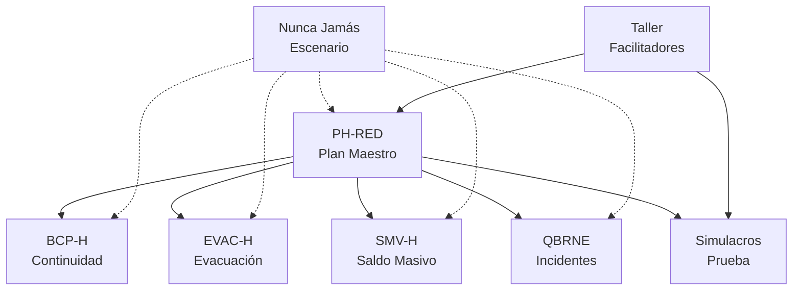

# 📚 Documentación CPES - Versiones Markdown

Este directorio contiene las versiones en formato Markdown de la documentación oficial del **Comité de Preparación para Emergencias y Desastres (CPES)** del IMSS, para la **Copa Mundial FIFA 2026**.

## 📋 Índice de Documentos

| # | Documento | Páginas (PDF) | Líneas (MD) | Descripción |
|---|-----------|---------------|-------------|-------------|
| 1 | [Ejercicio Hospital Nunca Jamás](./01-ejercicio-hospital-nunca-jamas.md) | 11 | 286 | Escenario de simulación multi-amenaza |
| 2 | [Guía Simulacros](./02-guia-simulacros.md) | 25 | 627 | Diseño y ejecución de simulacros |
| 3 | [Guía BCP-H](./03-guia-bcp-h.md) | 23 | 427 | Continuidad de Operaciones |
| 4 | [Guía EVAC-H](./04-guia-evac-h.md) | 26 | 469 | Evacuación de hospitales |
| 5 | [Guía PH-RED](./05-guia-ph-red.md) | 19 | 323 | Plan Hospitalario de Respuesta |
| 6 | [Guía QBRNE](./06-guia-qbrne.md) | 25 | 745 | Incidentes Intencionales |
| 7 | [Guía SMV-H](./07-guia-smv-h.md) | 22 | 578 | Saldo Masivo de Víctimas |
| 8 | [Nota Taller](./08-nota-conceptual-taller.md) | 7 | 200 | Formación de facilitadores |

**Total:** ~178 páginas PDF → 3,655 líneas Markdown

---

## 🏥 Sistema CPES Integrado

```
┌─────────────────────────────────────────────────────────────────┐
│                    SISTEMA DE PREPARACIÓN                       │
│                     HOSPITALARIA CPES                           │
├─────────────────────────────────────────────────────────────────┤
│                                                                 │
│   ┌─────────────┐                                              │
│   │   PH-RED    │ ◄── Plan Maestro                             │
│   │   (Plan     │      (Documento rector)                      │
│   │  Hospitalario│                                             │
│   │ de Respuesta)│                                             │
│   └──────┬──────┘                                              │
│          │                                                      │
│    ┌─────┼─────┬──────────┬──────────┬──────────┐              │
│    │     │     │          │          │          │              │
│    ▼     ▼     ▼          ▼          ▼          ▼              │
│ ┌────┐ ┌────┐ ┌────┐  ┌────┐   ┌────┐    ┌────────┐          │
│ │BCP-│ │EVAC│ │SMV-│  │QBRNE│  │Simula-│   │Nunca   │          │
│ │ H  │ │ -H │ │ H  │  │     │  │  cros │   │Jamás   │          │
│ │Continuidad│ │Evacuación│ │Saldo│  │Químicos│  │Ejercicios│   │(Caso)  │          │
│ │Operativa│ │Hospitalaria│ │Masivo│ │Radiológicos│  │Práctica│   │Integrador│        │
│ └────┘ └────┘ └────┘  └────┘   └────┘    └────────┘          │
│                                                                 │
└─────────────────────────────────────────────────────────────────┘
```

---

## 📖 Descripción de Cada Documento

### 1. Ejercicio Hospital Nunca Jamás
**Escenario de simulación ficticio** para la Copa Mundial FIFA 2026.

- Hospital de 220 camas en zona multi-amenaza
- **Amenazas:** Volcán activo, asentamientos irregulares, contaminación industrial
- **Contexto:** 35% población con discapacidad, riesgo sísmico, pandemia reciente
- Uso: Caso integrador para simulaciones

### 2. Guía de Simulacros
Metodología estandarizada para ejercicios de preparación.

- **Simulacros de Gabinete:** Ejercicios de escritorio/virtuales
- **Simulacros de Campo:** Ejercicios funcionales con despliegue real
- 6 pasos: Definición → Equipo → Diseño → Logística → Ejecución → Evaluación

### 3. Guía BCP-H (Business Continuity Plan)
Plan de Continuidad de Operaciones Hospitalarias.

- Identificación de procesos críticos por servicio
- Análisis de Impacto Operativo (BIA)
- Objetivos de Tiempo de Recuperación (OTR)
- Estrategias de mitigación y recuperación

### 4. Guía EVAC-H
Procedimiento para evacuación hospitalaria.

- Triage de evacuación (categorías A-D)
- Zonas de seguridad interna y externa
- Rutas de evacuación principales y alternas
- Priorización de áreas críticas (UCI, quirófanos, etc.)

### 5. Guía PH-RED
Plan Hospitalario de Respuesta ante Emergencias y Desastres.

- Documento rector del sistema
- Sistema de Comando de Incidentes (SCI-H)
- Enfoque multiamenaza
- Ciclo: Preparación → Elaboración → Prueba

### 6. Guía QBRNE
Respuesta a Incidentes Intencionales.

- **Q**uímicos
- **B**iológicos  
- **R**adiológicos/**N**ucleares
- **E**xplosivos
- Incluye: Tirador activo, ciberataques

### 7. Guía SMV-H
Saldo Masivo de Víctimas.

- Roles: Unidad de choque / Unidad insignia / Unidad de apoyo
- Sistema de triage (START, SIEVE)
- Expansión de capacidades
- Red Integrada de Servicios de Salud (RISS)

### 8. Nota Conceptual Taller
Formación de facilitadores institucionales.

- Objetivos del programa de capacitación
- Metodología andragógica
- Agenda de 4 horas
- Productos esperados

---

## 🔗 Relaciones entre Documentos



---

## 👥 Audiencias Objetivo

| Perfil | Documentos Prioritarios | Uso |
|--------|------------------------|-----|
| **Directivos Hospitalarios** | PH-RED, BCP-H | Toma de decisiones estratégicas |
| **Comité de Emergencias** | Todas las guías | Diseño e implementación de planes |
| **Personal Médico/Enfermería** | EVAC-H, SMV-H, QBRNE | Operación en emergencias |
| **Facilitadores CPES** | Simulacros, Taller | Capacitación en cascada |
| **Personal de Apoyo** | BCP-H, EVAC-H | Procedimientos específicos |

---

## 📁 Formato y Estructura

Cada documento Markdown incluye:

- ✅ **Metadatos** al inicio (título, fuente, fecha)
- ✅ **Índice navegable** con enlaces a secciones
- ✅ **Jerarquía de títulos** (`# ## ###`)
- ✅ **Listas** correctamente formateadas
- ✅ **Tablas** para datos estructurados
- ✅ **Diagramas** en formato ASCII/ texto
- ✅ **Definiciones** destacadas

---

## 🎯 Uso Recomendado

### Para Capacitación
1. Usar **Nunca Jamás** como escenario base
2. Aplicar **Simulacros** como metodología
3. Profundizar en guías específicas según riesgos

### Para Implementación
1. Iniciar con **PH-RED** (marco general)
2. Desarrollar **BCP-H** (continuidad operativa)
3. Crear planes específicos según contexto

### Para Ejercicios
1. Diseñar con **Guía de Simulacros**
2. Usar **Nunca Jamás** como caso
3. Evaluar con criterios de cada guía

---

## 📝 Notas de Conversión

- **Fuente original:** Archivos PDF oficiales CPES-IMSS (2026)
- **Conversión:** PyPDF2 para extracción + limpieza manual
- **Formato:** Markdown estándar (GitHub-flavored)
- **Revisión:** Eliminación de encabezados de página, normalización de espacios

---

## ⚠️ Consideraciones Legales

> **Derechos reservados © 2026**
> 
> Estos documentos son propiedad del IMSS. Queda prohibida la reproducción total o parcial sin autorización previa por escrito del titular de los derechos patrimoniales.
> 
> Uso permitido para fines de capacitación y preparación hospitalaria ante emergencias y desastres.

---

## 📞 Contacto

**Coordinación de Proyectos Especiales en Salud (CPES)**  
Dirección de Prestaciones Médicas - IMSS  
Paseo de la Reforma No. 476, 3er piso, Col. Juárez  
CP. 06600, Cuauhtémoc, Ciudad de México  
Tel: (55) 5238-2700 Ext. 10311

---

*Generado para el Plan Institucional de Atención Médica durante la Copa Mundial FIFA 2026*
